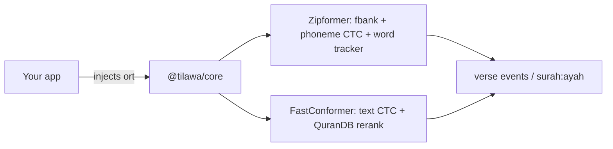

# Tilawa

> Formerly called offline-tarteel.

[](https://am.whhite.com/stats/yazinsai/tilawa)

Offline Quran recognition. Give it 16 kHz mono audio, get back `surah:ayah`. Fully on-device — web, mobile, or node, no network at inference time.

`@tilawa/core` is pure TypeScript with **zero native dependencies**. You inject the ONNX runtime, so the same package works everywhere by swapping which `onnxruntime` you wire in.

Two engines ship in the box. The default is **Zipformer** — a streaming Zipformer2-CTC over a 251-token tajweed-phoneme vocabulary, word-level tracking, 100% on both benchmarks. **FastConformer** (text CTC, one-shot or streaming) is still there under its original API.



## Install

```bash
npm i @tilawa/core
# plus the onnxruntime for your platform (you own this dep):
npm i onnxruntime-web            # browser / WASM
npm i onnxruntime-node           # node
npm i onnxruntime-react-native   # React Native
```

The default engine needs two files — the acoustic model and the phoneme corpus:

```bash
base=https://github.com/yazinsai/tilawa/releases/download/v0.3.0

curl -L -O "$base/zipformer_interp_gentle_a05.int8.onnx"  # 66 MB — the model
curl -L -O "$base/zipformer_quran.json"                    # 5.5 MB — phoneme corpus
```

Plus `quran.json` (all 6,236 verses) from [`web/frontend/public/quran.json`](web/frontend/public/quran.json) for the Arabic text in `verse_match` events. The model's I/O manifest is bundled in the package (`DEFAULT_ZIPFORMER_IO`), so you only override it if you export your own model.

Both Zipformer assets are **NPL-1.2** (non-commercial, share-alike) — see [NOTICE.md](NOTICE.md). If that doesn't work for you, run the MIT-licensed FastConformer engine instead ([below](#alternate-engine-fastconformer)).

## Quickstart

The core never imports `onnxruntime` — you pass the runtime in and it builds the session. Copy-paste adapters for each runtime live in [`packages/core/examples/`](packages/core/examples/).

```ts
import * as ort from "onnxruntime-web/wasm";
import { createRecognitionSession } from "@tilawa/core";

const session = await createRecognitionSession({
  ort,                                       // engine defaults to "zipformer"
  model: () => fetch("/zipformer_interp_gentle_a05.int8.onnx").then((r) => r.arrayBuffer()),
  corpus: () => fetch("/zipformer_quran.json").then((r) => r.json()),
  quran: () => fetch("/quran.json").then((r) => r.json()),
  onEvent: (msg) => {
    if (msg.type === "verse_match") console.log(`${msg.surah}:${msg.ayah}`, msg.verse_text);
  },
});

// push mono 16 kHz Float32 chunks as they arrive from the mic (~480 ms works well)
for await (const chunk of micChunks) await session.feed(chunk);

const final = await session.stop(); // flushes the tail, ends with final_sequence
session.reset();                    // start a new recitation, same loaded model
```

`createZipformerSession(opts)` is the same thing without the engine switch, and returns the richer `ZipformerSession` directly (`transcript`, `verses`, `engineState`, …).

### Node (onnxruntime-node)

```ts
import { readFile } from "node:fs/promises";
import * as ort from "onnxruntime-node";
import { createZipformerSession } from "@tilawa/core";

const session = await createZipformerSession({
  ort,
  model: () => readFile("zipformer_interp_gentle_a05.int8.onnx"),
  corpus: async () => JSON.parse(await readFile("zipformer_quran.json", "utf8")),
  quran: async () => JSON.parse(await readFile("quran.json", "utf8")),
});

await session.feed(pcm16k);
const final = await session.stop();
console.log(session.transcript, session.verses);
```

### React Native (onnxruntime-react-native)

RN can't hand the model to ORT as an `ArrayBuffer` — bundle the `.onnx` as an asset, copy it to the documents dir, create the session from the **path**, and pass that session in with the runtime's `Tensor`:

```ts
import * as ort from "onnxruntime-react-native";
import { createZipformerSession } from "@tilawa/core";

const session = await createZipformerSession({
  session: await ort.InferenceSession.create(modelPath),
  Tensor: ort.Tensor,
  corpus: () => loadJsonAsset("zipformer_quran.json"),
  quran: () => loadJsonAsset("quran.json"),
});
```

Full walkthrough — asset copying, mic wiring, Hermes caveats: [`packages/core/examples/react-native.md`](packages/core/examples/react-native.md).

## Alternate engine: FastConformer

The original text-CTC pipeline. Pick it when you need one-shot `transcribe()`, a raw Arabic transcript, or MIT-only assets. Download them from [release v0.2.0](https://github.com/yazinsai/tilawa/releases/tag/v0.2.0):

```bash
base=https://github.com/yazinsai/tilawa/releases/download/v0.2.0

curl -L -O "$base/fastconformer_full_mixed.onnx"  # 88 MB — goes into your SessionRunner
curl -L -O "$base/vocab.json"                      # TilawaAssets.vocab
curl -L -O "$base/quran_ctc_tokens.json"           # TilawaAssets.quranCtcTokens
```

Here you write a ~20-line `SessionRunner` that owns the `ort` dependency, then hand it to `createTilawaSession` along with the three JSON assets.

### FastConformer on web

```ts
import * as ort from "onnxruntime-web/wasm";
import { createTilawaSession, type SessionRunner } from "@tilawa/core";

async function createWebSessionRunner(modelBuffer: ArrayBuffer): Promise<SessionRunner> {
  ort.env.wasm.numThreads = 1; // single-threaded is the reliable default
  ort.env.wasm.simd = true;
  const session = await ort.InferenceSession.create(modelBuffer, {
    executionProviders: ["wasm"],
  });
  return {
    async run(audio) {
      const input = new ort.Tensor("float32", audio, [1, audio.length]);
      const length = new ort.Tensor("int64", BigInt64Array.from([BigInt(audio.length)]), [1]);
      const results = await session.run({ audio_signal: input, length });
      const output = results[session.outputNames[0]];
      const [, timeSteps, vocabSize] = output.dims as number[];
      return { logprobs: output.data as Float32Array, timeSteps, vocabSize };
    },
  };
}

const runner = await createWebSessionRunner(modelBuffer);
const session = createTilawaSession(runner, { vocab, quranCtcTokens, quran });

const pred = await session.transcribe(audioFloat32); // 16 kHz mono
// { surah: 1, ayah: 1, ayah_end: 3, score: 0.92, transcript: "..." }
```

### FastConformer on node

```ts
import { readFile } from "node:fs/promises";
import * as ort from "onnxruntime-node";
import { createTilawaSession, type SessionRunner } from "@tilawa/core";

async function createNodeSessionRunner(modelBuffer: Uint8Array): Promise<SessionRunner> {
  const session = await ort.InferenceSession.create(modelBuffer);
  return {
    async run(audio) {
      const input = new ort.Tensor("float32", audio, [1, audio.length]);
      const length = new ort.Tensor("int64", BigInt64Array.from([BigInt(audio.length)]), [1]);
      const results = await session.run({ audio_signal: input, length });
      const output = results[session.outputNames[0]];
      const [, timeSteps, vocabSize] = output.dims as number[];
      return { logprobs: output.data as Float32Array, timeSteps, vocabSize };
    },
  };
}

const runner = await createNodeSessionRunner(await readFile("fastconformer_full_mixed.onnx"));
const session = createTilawaSession(runner, { vocab, quranCtcTokens, quran });
const pred = await session.transcribe(audioFloat32);
```

### FastConformer on React Native

RN can't hand the model to ORT as an `ArrayBuffer` — bundle the `.onnx` as an asset, copy it to the documents dir, and pass the **file path**.

```ts
import * as ort from "onnxruntime-react-native";
import { createTilawaSession, type SessionRunner } from "@tilawa/core";

async function createRNSessionRunner(modelPath: string): Promise<SessionRunner> {
  const session = await ort.InferenceSession.create(modelPath);
  return {
    async run(audio) {
      const input = new ort.Tensor("float32", audio, [1, audio.length]);
      const length = new ort.Tensor("int64", BigInt64Array.from([BigInt(audio.length)]), [1]);
      const results = await session.run({ audio_signal: input, length });
      const output = results[session.outputNames[0]];
      const [, timeSteps, vocabSize] = output.dims as number[];
      return { logprobs: output.data as Float32Array, timeSteps, vocabSize };
    },
  };
}

const runner = await createRNSessionRunner(modelPath);
const session = createTilawaSession(runner, { vocab, quranCtcTokens, quran });
const pred = await session.transcribe(audioFloat32);
```

### FastConformer streaming

FastConformer also streams: feed chunks with `feed()` and its tracker emits the same verse events.

```ts
const session = createTilawaSession(runner, assets, {
  config: "balanced", // or a Partial<StreamingConfig>
  onOutput: (msg) => {
    if (msg.type === "verse_match") console.log(`${msg.surah}:${msg.ayah}`, msg.confidence);
  },
});

// push ~300ms Float32 chunks as they arrive from the mic
for await (const chunk of micChunks) await session.feed(chunk);

session.reset(); // start a new recitation
```

It has no explicit `stop()` — it finalizes on trailing silence. Wrap it in `createRecognitionSession({ engine: "fastconformer", runner, assets })` if you want the uniform `feed()`/`stop()`/`reset()` surface; `stop()` there feeds the silence for you.

## Verse events

Both engines emit the same `WorkerOutbound` union — via the `onEvent`/`onOutput` callback, and as the return value of `feed()`/`stop()`. The ones you care about:

| `msg.type` | Meaning | Key fields |
|---|---|---|
| `verse_match` | Confident match for the current verse | `surah`, `ayah`, `verse_text`, `surah_name`, `confidence`, `surrounding_verses` |
| `verse_candidate` | Ranked candidates before lock-in | `candidates[]`, `stable`, `final_flush` |
| `word_progress` | Word-level alignment within a verse | `surah`, `ayah`, `word_index`, `total_words`, `matched_indices` |
| `final_sequence` | Full ordered sequence when recitation ends | `verses[]`, `confidence` |

## API reference

### `createRecognitionSession(options)`

The engine switch. `engine` defaults to `"zipformer"` (`DEFAULT_ENGINE`); pass `engine: "fastconformer"` with `{ runner, assets }` for the other path. Returns a `RecognitionSession`:

| Member | Purpose |
|---|---|
| `feed(chunk)` | Push mono 16 kHz `Float32Array` → `WorkerOutbound[]` |
| `stop()` / `flush()` | End of audio: flush the tail, emit remaining verses + `final_sequence` |
| `reset()` | Drop all state, keep the loaded model |
| `engine` | `"zipformer"` \| `"fastconformer"` |
| `zipformer` / `fastconformer` | The underlying session, or `null` for the engine you didn't pick |

### `createZipformerSession(options)` → `ZipformerSession`

The default engine, unwrapped. ONNX comes in one of two shapes:

- `{ ort, model }` — the runtime namespace plus model bytes (`Uint8Array`, `ArrayBuffer`, or a loader returning either). The session is created for you with `executionProviders` (default `["cpu"]`).
- `{ session, Tensor }` — an `InferenceSession` you created plus that runtime's `Tensor` constructor. This is the React Native shape, where `create()` takes a file path.

| Option | Default | Purpose |
|---|---|---|
| `corpus` | *required* | Parsed `zipformer_quran.json`, or a loader for it |
| `quran` | empty | Arabic text for `verse_match`; raw `quran.json` rows, a `QuranDB`, or a loader |
| `io` | `DEFAULT_ZIPFORMER_IO` | Model I/O manifest — override only for your own export |
| `onEvent` | — | Verse events, same order `feed()`/`stop()` return them |
| `config` | `DEFAULT_CONFIG` | `Partial<EngineConfig>` — fbank/CTC/search/tracker knobs |
| `minWordFraction` | `0.5` | Fraction of an ayah's words that must land before it's emitted |
| `enableFallback` | `true` | Whole-ayah search over the transcript when nothing locked |
| `stayOnSurah` | `false` | Never relocate off the surah we locked onto |
| `allowGaps` / `gapMaxWords` | `false` / `3` | Let `verses` bridge one short skipped ayah |
| `tailSeconds` | `2.0` | Silence `stop()` appends to flush the CTC tail |

Beyond `feed()`/`stop()`/`flush()`/`reset()`, the session exposes `transcript` (raw phonemes), `tallies` / `verses` (per-ayah word tallies, gated), `engineState` (`"searching"` \| `"tracking"`), and `config`.

### `createTilawaSession(runner, assets, options?)` → `TilawaSession`

```ts
createTilawaSession(runner: SessionRunner, assets: TilawaAssets, options?): TilawaSession
```

**`TilawaAssets`** — the JSON blobs you load (model bytes go into the runner, not here):

```ts
interface TilawaAssets {
  vocab: Record<string, string>;      // vocab.json (CTC token id -> string)
  quranCtcTokens: CtcTokenTable;       // quran_ctc_tokens.json
  quran: unknown[];                    // quran.json (6,236 verse records)
  blankId?: number;                    // defaults to 1024
}
```

**`SessionRunner`** — the seam you implement (see quickstarts):

```ts
interface SessionRunner {
  run(audio: Float32Array): Promise<{
    logprobs: Float32Array;
    timeSteps: number;
    vocabSize: number;
  }>;
}
```

`audio` is **borrowed, not owned** — treat it as read-only. The streaming tracker
hands over its live window buffer instead of copying it on every cycle, so a runner
that writes into the samples (padding, resampling, normalizing in place) will corrupt
the tracker's state. Copy first if you need to modify them.

**`TilawaSession`** — what you get back:

| Method | Purpose |
|---|---|
| `transcribe(audio)` | One-shot → `{ surah, ayah, ayah_end, score, transcript }` (0/0 on no match) |
| `transcribeRaw(audio)` | One-shot → full `TranscribeResult` (acoustic logprobs + champion match) |
| `feed(chunk)` | Streaming → `WorkerOutbound[]`, also fired via `onOutput` |
| `reset()` | Reset the streaming tracker for a new recitation |
| `setConfig(partial)` | Update streaming config live |
| `getConfig()` | Current effective `StreamingConfig` |
| `db` | Underlying `QuranDB` (verse lookup, search) |
| `decoder` | Underlying `TextCTCDecoder` |

**Streaming config** — pass a preset name or a `Partial<StreamingConfig>` via `options.config`:

- `"conservative"` — waits for strong evidence before locking a verse (fewer false matches)
- `"balanced"` — the default (`DEFAULT_STREAMING_CONFIG`)
- `"aggressiveAdvance"` — advances quickly, best for continuous recitation

The full `StreamingConfig` interface, the three presets (`CONSERVATIVE_STREAMING_CONFIG`, `BALANCED_STREAMING_CONFIG`, `AGGRESSIVE_ADVANCE_STREAMING_CONFIG`), and every exported type are re-exported from `@tilawa/core`.

## Models

### Zipformer (default)

| | Value |
|---|---|
| **Model** | `interp-gentle-a0.5` — 0.5 × `Quran-Lab/zipformer_p-arabic-v3` v3.1 + 0.5 × our gentle fine-tune |
| **File** | `zipformer_interp_gentle_a05.int8.onnx` — 66 MB, int8 dynamic MatMul |
| **Input** | 16 kHz mono `Float32Array`, streamed; 80-bin Kaldi fbank computed in TypeScript |
| **Output** | Streaming CTC over 251 tajweed-phoneme tokens → whole-Quran phoneme n-gram search → per-surah online DP tracker → per-word verdicts |
| **Recall / Precision / SeqAcc** | 100% / 100% / 100% on v1 (53/53) and v2 (43/43), median of 3 streaming repeats |
| **Latency** | ~5% RTF single-threaded CPU (real-time with room to spare) |
| **License** | **NPL-1.2** — non-commercial, share-alike ([NOTICE.md](NOTICE.md)) |

### FastConformer

| | Value |
|---|---|
| **Model** | Cyberistic's `c2c-direct-mixed-tta` (base: `nvidia/stt_ar_fastconformer_hybrid_large_pcd_v1.0`) |
| **File** | `fastconformer_full_mixed.onnx` — 88 MB, int4 MatMul + int8 Conv/LayerNorm |
| **Input** | 16 kHz mono audio, `Float32Array` (preprocessing baked into the graph) |
| **Output** | CTC logprobs over 1025-token Arabic BPE vocab, then CTC re-rank against Quran candidates |
| **Recall / Precision / SeqAcc** | 100% / 100% / 100% on the v1 53-sample benchmark (median of 3 runs) |
| **Latency** | 0.84s average on Apple Silicon CPU |
| **License** | [CC-BY-4.0](https://huggingface.co/nvidia/stt_ar_fastconformer_hybrid_large_pcd_v1.0) (NVIDIA model) |

## Live demo

[`web/frontend/`](web/frontend/) is a complete browser app that runs the SDK live — record and watch verses lock in in real time. It's also the regression guard for the SDK.

The demo runs the SDK's default Zipformer engine in a Web Worker — the worker is a thin host over `ZipformerSession` from `@tilawa/core`: **100% recall / 100% precision / 100% sequence accuracy** on v1 (53/53) and v2 (43/43), median of 3 streaming repeats. Append `?engine=fastconformer` (or set `localStorage.tilawaEngine`) to fall back to the FastConformer worker.

```bash
cd web/frontend && npm run dev
```

## Research & benchmarks

The model behind this SDK is the winner of a 20-approach bake-off (Whisper variants, pruned CTC, FastConformer sweeps, contrastive/embedding attempts). All of that — the Python benchmark harness, experiment code, training scripts, and per-approach writeups — lives under [`lab/`](lab/). Start with [`lab/EXPERIMENTS.md`](lab/EXPERIMENTS.md) and [`lab/AGENTS.md`](lab/AGENTS.md).

## Acknowledgements & licensing

Zipformer acoustic models, vocabulary, phoneme lexicon, and eval scripts derive from [Quran-Lab/zipformer_p-arabic-v3](https://huggingface.co/Quran-Lab/zipformer_p-arabic-v3) (Muno459 / Quran-Lab). The streaming prompter engine and `quran.json` phoneme corpus come from alketab's [ملقّن القرآن](https://prompter.alketab.app/). Zipformer-derived models (`quran_phoneme_zipformer.onnx`, `ft-*`, `interp-gentle-a0.5`, tokens, lexicon, labels) are **NPL-1.2** (non-commercial, share-alike) and are not covered by this repo's MIT licence. Details: [NOTICE.md](NOTICE.md).
